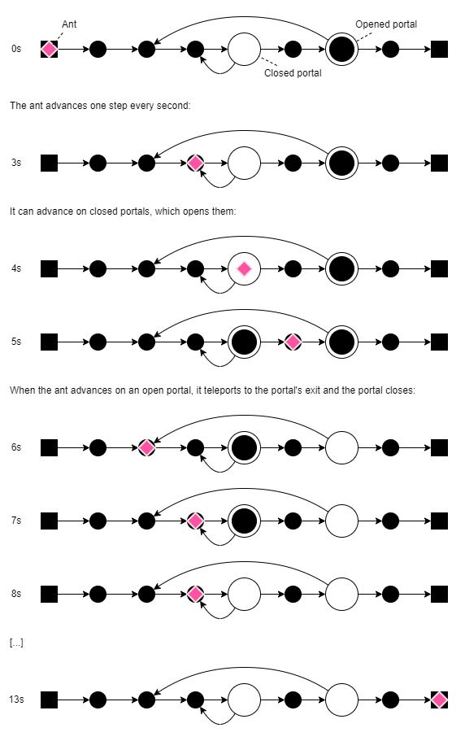

# Teleporting Ant Problem

The teleporting ant problem consists of an ant advancing in a single direction on a one-dimentional discrete and finite path.
The path is composed of steps which can be one of two kinds:

1. an empty step, which does nothing to the ant
2. a portal, which can be open or closed and teleports the ant to its exit located on a previous step

Each second, the ant walks one step forward and, when it walks into an open portal, teleports to the portal's exit.
When the ant enters an open portal, it immediatly closes.
When the ant walks over a closed portal, it opens again.

The problem's goal is to compute the time needed for the ant to finish an arbitrary path without simulating its movements.

Here is an example of a path:

